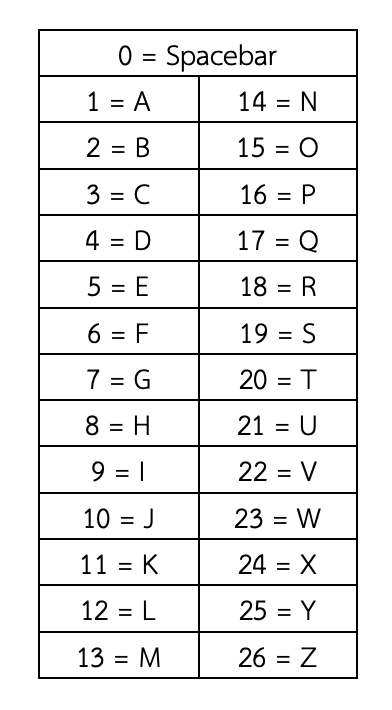
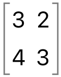

##### Restrict Word: import
ตอนนี้พี่อยู่หน้าพีระมิดแห่งหนึ่งแต่พี่รู้สึกได้ว่าข้างในพีระมิดต้องมีสมบัติบางอย่างแน่ๆ แต่เหมือนพี่ประตูของพีระมิดมันจะถูกล็อคด้วยรหัสอยู่ แต่ที่ข้างๆที่ใส่รหัสเหมือนมี hint เขียนไว้อยู่ ซึ่ง hint เขียนไว้ว่า 
1. แบ่งตัวเลขที่เห็นให้เป็น Matrix ขนาด 1 x n ( n คือขนาดของ Matrix inverse ) 
2. นำ Matrix ที่หาได้จากข้อ 1 ไปคูณกับ Inverse Matrix ที่ให้มาทีละ Matrix
3. นำผลลัพธ์ที่ได้จากการคูณไปเทียบกับตัวเลขที่ในตารางให้ไปแต่ละตัวว่าตัวเลขแต่ละตัวนั้นคือตัวอักษรอะไร




แต่ตอนนี้พี่ไม่สามารถทดเลขได้เลย พี่รบกวนให้น้องหารหัสนั้นให้พี่ได้มั้ยครับ

hint : [สำหรับน้องที่ยังไม่ได้เรียนเรื่อง Matrix นะครับบ](https://nockacademy.com/math/%E0%B8%81%E0%B8%B2%E0%B8%A3%E0%B8%9A%E0%B8%A7%E0%B8%81-%E0%B8%A5%E0%B8%9A-%E0%B9%81%E0%B8%A5%E0%B8%B0%E0%B8%84%E0%B8%B9%E0%B8%93%E0%B9%80%E0%B8%A1%E0%B8%97%E0%B8%A3%E0%B8%B4%E0%B8%81%E0%B8%8B%E0%B9%8C/)

สำหรับ input บรรทัดที่ 2 จาก Sample Testcase 1 หน้าตา Matrix จะเป็นประมาณนี้นะครับ


Input Specification: 
**2 บรรทัด**
**บรรทัดที่ 1 :** ชุดตัวเลขที่ต้องการถอดรหัส
**บรรทัดที่ 2 :** Inverse ของ Matrix A ที่มีขนาดตั้งแต่ n x n ( n &gt;= 2 ) และตัวเลขใน Matrix เป็นจำนวนเต็มทั้งหมด โดย list ย่อยแต่ละอันคือ 1 แถวใน Matrix ไล่จากแถวบนสุดไปล่างสุด


Output Specification:
**1 บรรทัด**
- ข้อความที่ได้จากการถอดรหัสด้วย Matrix ( เป็นตัวพิมพ์ใหญ่ทั้งหมด )

Sample Testcase 1:
Input :
```
-45 34 36 -24 -43 37 -23 22 -37 29 57 -38 -39 31
[["3","2"],["4","3"]]
```
Output :
```
ALL SYSTEMS GO
```

Sample Testcase 2:
Input :
```
13 -26 21 33 -53 -12 18 -23 -42 5 -20 56 -24 23 77
[["-1","-10","-8"],["-1","-6","-5"],["0","-1","-1"]]
```
Output :
```
MEET ME MONDAY
```
